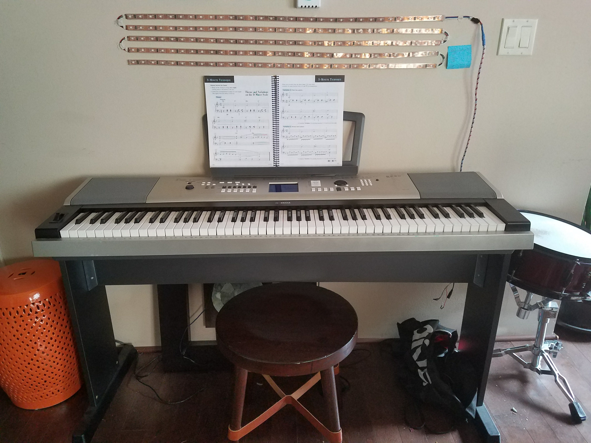

# Simulated Chromestesia

Chromestesia, or Sound-to-Color Synesthesia, is a condition where a person is able to see colors that match the noises they hear. For example, if a guitar string is plucked, a person with Chromestesia will also sense a specific color matching the note that was played.

This project uses an electronic keyboard, a Raspberry Pi, and LED strips to simulate this experience.

## How it works

The system connects a keyboard to a Raspberry Pi in order to transmit the MIDI data of what's being played on the keyboard to the Raspberry Pi. There is a Python program running in the Raspberry Pi that takes in the MIDI data. This data lets the Python program know what note was played on the keyboard, and how hard the note was pressed.

Each key on the keyboard has a mapping to one of the 100 LED lights available in the LED strips. And each note has a color specific to it, for example, all A's are red. When a person hits a key on the keyboard, the Python program receives that MIDI data, and turns on the mapped LED to the color of that note, and sets it to a brigthness level relative to how hard the key was pressed.
